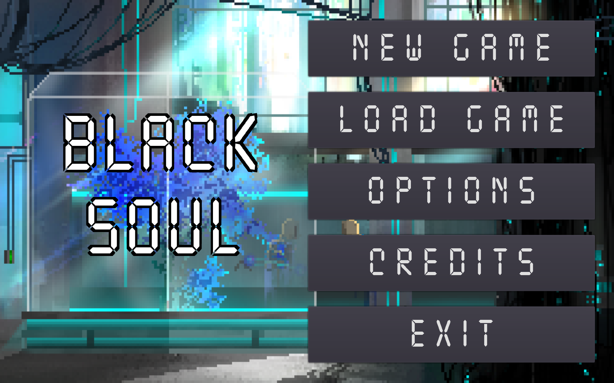

# BlackSoul

Black Soul is a top-down 2D action game made in Godot 3 in Summer 2018, focusing on the concept of being unable to fight back directly, instead relying on enemies
shooting each other and using the environment to solve puzzles. Players will dodge turret shots, and then use those turret shots to break
the environment, opening up new paths, defeating enemies and unlocking new abilities.

The Team:
* Kieran Downs (Executive Producer, Audio)
* Boris Fleysher (Lead Developer, Lead Designer, Producer)
* Nelson Chen (Art, Sprites, Environment)
* Taylor Folkersen (Programmer/Developer)
* Omer Ahmed (Programming Support)
* Jonas Liew (Story Direction)

Visit [this itch.io](https://omergosh.itch.io/black-soul) for a trailer and cooler overall presentation

## Screenshots

